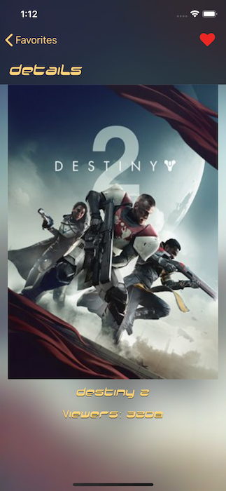

# Top Games

A demo app to show a list of top games using `Twitch TV API`.  

**Repository:** `https://github.com/limadeveloper/iOS-TopGames.git`  

**Requirements**  

- Swift 4
- Storyboard
- UICollectioView
- Endless Scroll
- Autolayout
- CoreData
- Pull to Refresh
- Unit Tests
- cocoapods

**Pods**

- KTCenterFlowLayout
- Alamofire
- AlamofireImage
- SwiftLint
- Quick
- Nimble

**Images**  

